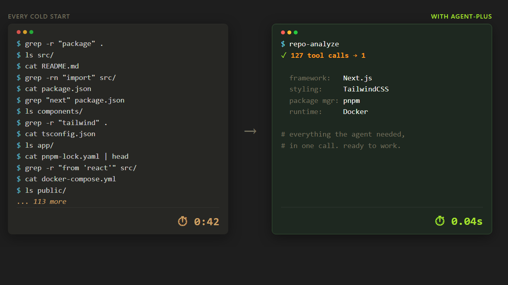
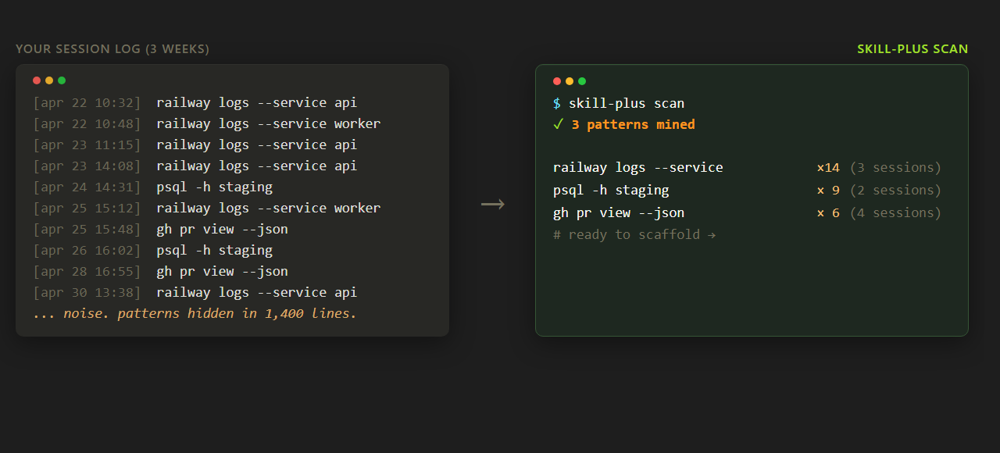
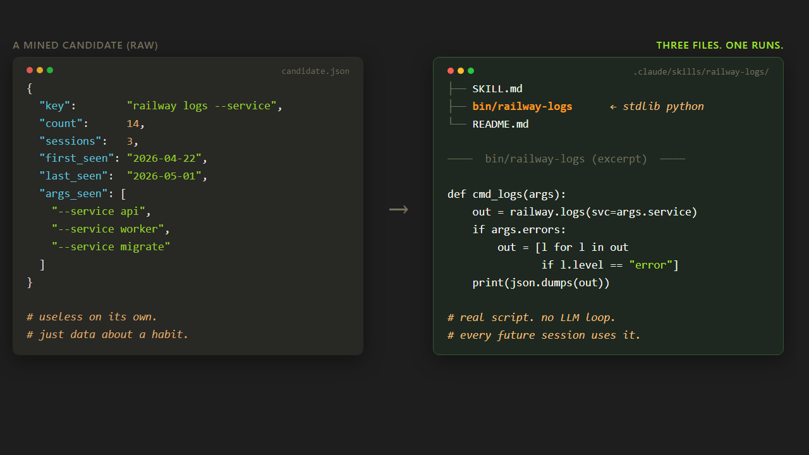
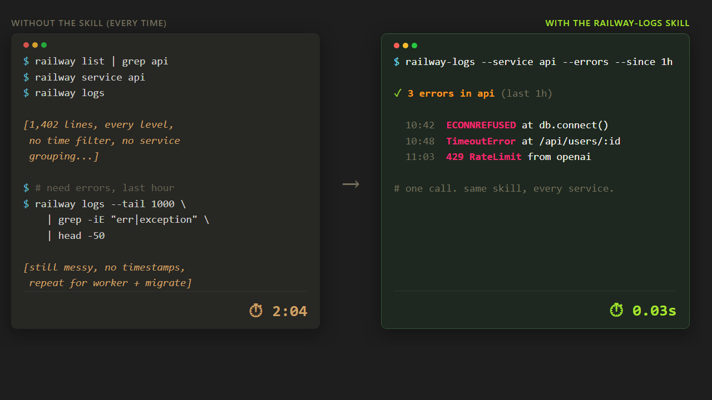

# agent-plus

[](LICENSE) [](https://github.com/osouthgate/agent-plus/releases) [](https://github.com/osouthgate/agent-plus/actions/workflows/ci.yml) [](#) [](#) [](#)

**Cut tokens. Kill context bloat. Run 20x faster.**

Drop-in plugins for Claude Code that turn 127-tool-call dances into 1-tool-call answers. **No SDK, no config file, no auth dance.**

Five plugins. Zero dependencies. Mined from real Claude Code session transcripts — not guessed at. Stdlib Python, also runs standalone.

### It collapses every cold start.

<p align="center">
  
  <br>
  <sub><i>One call replaces the cold-start grep dance. That's the whole product.</i></sub>
</p>

### It learns from how you actually work.

<p align="center">
  
  <br>
  <sub><i>Three commands you typed 30+ times this week — ready to scaffold.</i></sub>
</p>

### And turns those patterns into deterministic scripts.

<p align="center">
  
  <br>
  <sub><i>Real scripts that run. Cuts tokens. Faster than the agent loop.</i></sub>
</p>

A scaffolded skill is **three files in your repo, and one of them runs**:

```text
.claude/skills/railway-logs/
├── SKILL.md          # how the agent discovers the skill
├── bin/railway-logs  # stdlib python, runs deterministically
└── README.md         # auto-generated docs
```

The script is real stdlib Python. The boilerplate is pre-wired (argparse, envelope contract, secret redaction, layered env resolver — ~200 lines you don't write). You fill in the killer-command body. Here's a real one from the [`railway-ops`](https://github.com/osouthgate/agent-plus-skills/tree/main/railway-ops) skill (sibling marketplace):

```python
# Real, shipped: agent-plus-skills/railway-ops/bin/railway-ops
# Stdlib only. Agent invokes the binary directly — no LLM in the loop.

def parse_log_entries(raw: str) -> list[dict[str, Any]]:
    """Parse `railway logs --json` output. Soft-fails on malformed lines."""
    entries: list[dict[str, Any]] = []
    for raw_line in raw.splitlines():
        line = raw_line.strip()
        if not line:
            continue
        try:
            obj = json.loads(line)
            entries.append(obj if isinstance(obj, dict)
                           else {"message": str(obj), "_non_object": True})
        except json.JSONDecodeError:
            entries.append({"message": line, "_non_json": True})
    return entries
```

Deterministic shape in, deterministic shape out. Permanent across every future session — no LLM loop, no token cost beyond the call.

### Then you use it. Every session.

<p align="center">
  
  <br>
  <sub><i>One clean call where 14 used to be — same skill, every service, forever.</i></sub>
</p>

```bash
curl -fsSL https://raw.githubusercontent.com/osouthgate/agent-plus/main/install.sh | sh
```

That's it. The wizard takes it from here.

**Jump to:** [Tour](#a-90-second-tour) · [Install](#install) · [Before / after](#before--after) · [Marketplace](#the-marketplace-convention) · [Status](#project-status) · [Contributing](#contributing)

---

## What it does

Every cold start in an unfamiliar repo, the same dance: ~67 grep ops, ~60 ls / directory walks, a sweep through `package.json` / `pyproject.toml` / `Cargo.toml` / `go.mod`, a README scan. Mined across real Claude Code transcripts, every time.

`repo-analyze` collapses that into one call:

```bash
$ repo-analyze --pretty | head -25
{
  "tool": {"name": "repo-analyze", "version": "0.2.1"},
  "languages": {"typescript": {"files": 142, "loc": 18203, "percent": 71.4}, ...},
  "frameworks": [
    {"name": "Next.js",     "evidence": "package.json:next",      "confidence": "high"},
    {"name": "TailwindCSS", "evidence": "package.json:tailwindcss", "confidence": "high"}
  ],
  "buildTools": [{"name": "pnpm", "evidence": "pnpm-lock.yaml"}, {"name": "Docker", ...}],
  "deps": { ... },
  "entrypoints": ["src/app/page.tsx", "manage.py", ...],
  "tree": { ... },
  "readme": {"title": "...", "headings": [...]}
}
```

One JSON blob. ~127 tool calls collapsed into 1. The agent stops re-discovering what it already discovered last session.

That's one plugin. The framework ships **five universal primitives**:

| Plugin | What it collapses | Killer command |
| :--- | :--- | :--- |
| [`agent-plus-meta`](./agent-plus-meta) | "What's installed, what's configured, what does this checkout know?" — workspace bootstrap, env-var readiness, identity cache, marketplace lifecycle | `init`, `envcheck`, `refresh`, `marketplace install\|search\|prefer` |
| [`repo-analyze`](./repo-analyze) | The ~67-grep + ~60-ls cold-start dance for unfamiliar repos | `repo-analyze [--output] [--shape-depth] [--pretty]` |
| [`diff-summary`](./diff-summary) | The 5–20 Read calls to triage a PR ("test? source? config? did the public API change?") | `diff-summary [--staged \| --base BRANCH \| --range A..B] [--public-api-only] [--risk MIN]` |
| [`skill-feedback`](./skill-feedback) | "Was that skill any good?" — agent self-rates, JSONL on disk, optional bundle into a GitHub issue | `log <skill> --rating --outcome [--friction]`, `report`, `submit` |
| [`skill-plus`](./skill-plus) | "I keep typing this by hand" → mine the session log, scaffold a real skill, audit it, promote it to your marketplace | `scan`, `propose`, `scaffold <name> --from-candidate <id>`, `inquire <tool> [--audit]`, `list`, `feedback`, `promote <name>` |

Plus a **marketplace convention** — `<user>/agent-plus-skills` — for publishing your own service-specific wrappers (GitHub, Vercel, Supabase, Railway, Linear, OpenRouter, Coolify, Hetzner, Hermes, Langfuse, etc.). Reference marketplace lives at [`osouthgate/agent-plus-skills`](https://github.com/osouthgate/agent-plus-skills) — install it, fork it, or use it as a template.

## A 90-second tour

```text
$ agent-plus-meta init                         # creates .agent-plus/, idempotent
✓ created manifest.json, services.json, env-status.json

$ agent-plus-meta envcheck                     # which sibling-plugin env vars are set?
✓ ready: github-remote, vercel-remote, langfuse-remote
✗ missing: SUPABASE_ACCESS_TOKEN  →  supabase-remote unconfigured

$ agent-plus-meta refresh                      # resolves project IDs once; written to services.json
✓ services: 6 ok, 1 unconfigured  (4.2s)

$ repo-analyze --pretty | jq '.frameworks'     # cold-start orientation
[{"name": "Next.js", "evidence": "package.json:next", "confidence": "high"},
 {"name": "TailwindCSS", "evidence": "package.json:tailwindcss", "confidence": "high"}]

$ diff-summary --base main                     # one-call PR triage
{"summary": {"highRisk": 0, "publicApiTouches": 1, "missingTests": 0, ...}}

$ skill-plus scan --pretty                     # mine the session log for repeated patterns
{"candidatesNew": 3, "candidates": [
  {"key": "railway logs --service", "count": 14, "sessions": 3, ...}]}

$ skill-plus scaffold railway-probe --from-candidate 8ad12e3f9be1   # turn pattern → skill
✓ wrote .claude/skills/railway-probe/{SKILL.md, bin/, ...}
```

## Install

One-line install — drops you straight into the wizard:

```bash
curl -fsSL https://raw.githubusercontent.com/osouthgate/agent-plus/main/install.sh | sh
```

That installs all five primitives, then chains into `agent-plus-meta init`. The wizard detects your state (new to Claude Code? returning on a fresh machine? skill author with `.claude/skills/` already?) and runs the right first command for you. No flag-juggling, no doc-hunting.

### What happens when you install

The wizard adapts to one of three branches based on what it finds:

- **NEW** — no skills, no session history, no env-vars: runs `repo-analyze` against your current repo as the first win. If you run `install.sh` from outside any project (e.g., your home directory), the wizard pivots to cross-repo discovery instead of trying to analyze a non-project.
- **RETURNING** — fresh machine, existing `.agent-plus/` markers or `~/.claude/projects/` history: runs `agent-plus-meta doctor` first to confirm the install.
- **SKILL-AUTHOR** — `.claude/skills/` already populated: runs `skill-plus list --include-global` to surface your existing skills + collisions.

Then it offers a per-repo opt-in cross-repo scan against the four most recently active repos under `~/.claude/projects/`, and ends with a coherent `doctor` verdict.

Run the wizard again any time (`agent-plus-meta init`) — it's idempotent.

### CI / automation

For agent harnesses or CI:

```bash
curl -fsSL .../install.sh | sh -s -- --unattended      # accept defaults, exit 0 on partial install
curl -fsSL .../install.sh | sh -s -- --no-init         # install primitives only, skip the wizard
agent-plus-meta init --non-interactive --auto          # deterministic JSON envelope to stdout
```

The `--non-interactive --auto` envelope is a frozen public contract — see [`agent-plus-meta/README.md`](./agent-plus-meta/README.md#init).

### Uninstalling

agent-plus owns its off-ramp end-to-end. `install.sh --uninstall` (or `agent-plus-meta uninstall`) removes the 5 primitive bins by default and KEEPS your workspaces, marketplaces, plugins, sessions, and skills unless you opt in with `--workspace`, `--marketplaces`, `--all`, or `--purge`. Full flag matrix and the JSON envelope schema: see [`agent-plus-meta/README.md`](./agent-plus-meta/README.md#uninstall).

### Manual install

```bash
# All five framework primitives in one go
claude plugin marketplace add osouthgate/agent-plus
for p in agent-plus-meta repo-analyze diff-summary skill-feedback skill-plus; do
  claude plugin install $p@agent-plus
done
```

Or pick the ones you want:

```bash
claude plugin marketplace add osouthgate/agent-plus
claude plugin install repo-analyze@agent-plus       # cold-start orientation
claude plugin install diff-summary@agent-plus       # PR triage
claude plugin install skill-feedback@agent-plus     # rate skills as you use them
claude plugin install skill-plus@agent-plus         # mine sessions for new skills
claude plugin install agent-plus-meta@agent-plus    # workspace bootstrap + marketplace lifecycle
```

Then add service wrappers from the reference marketplace:

```bash
# Commit-pinned + first-run review (gh, vercel, supabase, railway, linear, ...)
agent-plus-meta marketplace install osouthgate/agent-plus-skills

# Or scaffold your own
agent-plus-meta marketplace init <your-handle>/agent-plus-skills

# Or discover other people's
agent-plus-meta marketplace search [query]
```

Standalone (no Claude Code): every `bin/<plugin>` is one stdlib Python 3 file. Copy to `$PATH`, run.

## Before / after

| Without agent-plus | With agent-plus |
|---|---|
| `~67 grep + ~60 ls` per cold start | `repo-analyze` — 1 call |
| `git diff` + 5–20 Reads to triage a PR | `diff-summary --staged` — 1 call with role + risk per file |
| Manual `gh pr view --json` + `gh run list` + `gh pr checks` triage | `github-remote pr <name>` — one structured overview |
| "Did that skill work? Should I keep using it?" — never tracked | `skill-feedback log` after each use; `report` aggregates; `submit` files an upstream issue. Evidence you can act on. |
| "I keep typing this by hand" — stays manual forever | `skill-plus scan` mines the session log, `scaffold` writes the skill |
| UUID-shaped IDs leaking into the agent's context | Name-resolved IDs everywhere; UUIDs never enter the transcript |
| Env-var values, tokens, secrets in command output | NAMES-only — values stripped on read paths, scrub-on-write on log paths |

## The marketplace convention

`<user>/agent-plus-skills` is the convention. Anyone can publish their own collection at their GitHub handle. agent-plus's tooling discovers, installs, and updates them by that naming pattern — borrowed from Homebrew taps and the GitHub Actions marketplace. **No central registry to run.**

```text
                  ┌─────────────────────────────────────┐
                  │   osouthgate/agent-plus  (this repo)│
                  │   The 5 universal primitives        │
                  └────────────────┬────────────────────┘
                                   │
                  agent-plus-meta marketplace install
                                   │
                                   ▼
        ┌────────────────────────────────────────────────────┐
        │  <user>/agent-plus-skills  (anyone can publish)    │
        │  github-remote, vercel-remote, supabase-remote,    │
        │  railway-ops, linear-remote, openrouter-remote,    │
        │  langfuse-remote, hermes-remote, coolify-remote,   │
        │  hcloud-remote  (the reference marketplace)        │
        │  + your own at <your-handle>/agent-plus-skills     │
        └────────────────────────────────────────────────────┘
```

```bash
agent-plus-meta marketplace search          # gh search repos topic:agent-plus-skills
agent-plus-meta marketplace install <user>/agent-plus-skills    # commit-pinned + first-run review
agent-plus-meta marketplace list
agent-plus-meta marketplace update [<user>/<repo>]
agent-plus-meta marketplace prefer <user>/<repo> --skill <name>  # collision resolution
agent-plus-meta marketplace remove <user>/<repo>
```

**Trust model — five gates enforced.** Install pins the commit SHA. Nothing in the cloned repo runs at install time. A first-run review is shown once per install (and re-armed on every accepted update). Updates are opt-in only — `--cron` is parsed only so it can be refused. When a marketplace declares `checksums`, install verifies them. Plugins from un-accepted marketplaces are skipped.

### Versioning

The umbrella `VERSION` file (and the badge above) is **tag-bound** — it tracks the framework release tag (e.g. `0.16.0`). Each plugin under `agent-plus-meta/`, `repo-analyze/`, `diff-summary/`, `skill-feedback/`, and `skill-plus/` carries its own `plugin.json#version` that bumps **independently** when that specific plugin changes. So `repo-analyze@0.2.1` shipping inside framework `0.16.0` is normal, not drift.

## Project status

Five primitives. Four (`agent-plus-meta`, `repo-analyze`, `diff-summary`, `skill-feedback`) plus the marketplace lifecycle have been dogfooded for months. `skill-plus` is the newer addition (0.4.0 — `scan`/`scaffold`/`inquire` are stable; the rest of the surface is settling). Pre-1.0 — but cold-start orientation and diff triage are production-stable.

The framework is for **Claude Code** — claude.ai web Skills and Cowork are out of scope (no Bash, no filesystem, no plugin loader). For prompt-template skill generation, see [`claude-reflect`](https://github.com/cnocon/claude-reflect)'s `/reflect-skills` — it complements agent-plus rather than competes with it.

Service wrappers — `github-remote`, `vercel-remote`, `supabase-remote`, `railway-ops`, `linear-remote`, `openrouter-remote`, `langfuse-remote`, `hermes-remote`, `coolify-remote`, `hcloud-remote` — live in [`osouthgate/agent-plus-skills`](https://github.com/osouthgate/agent-plus-skills).

## Contributing

Architecture, conventions, design philosophy, the seven patterns, and the envelope contract are documented in [`CONTRIBUTING.md`](./CONTRIBUTING.md). Doc-drift rules and writing conventions are in [`AGENTS.md`](./AGENTS.md).

Iterate locally without reinstalling:

```bash
claude --plugin-dir ./<plugin-name>
# edit SKILL.md / bin/<name> / README.md
# /reload-plugins to pick up changes
```

## License

MIT, see [LICENSE](./LICENSE).
